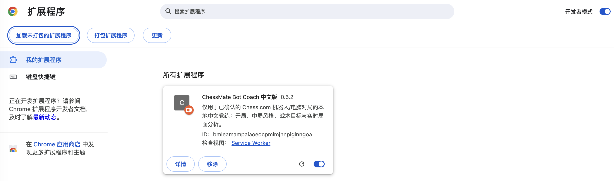
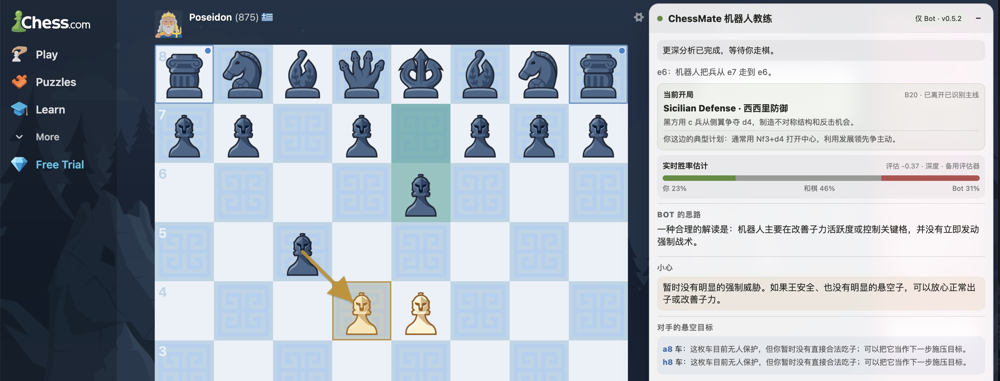
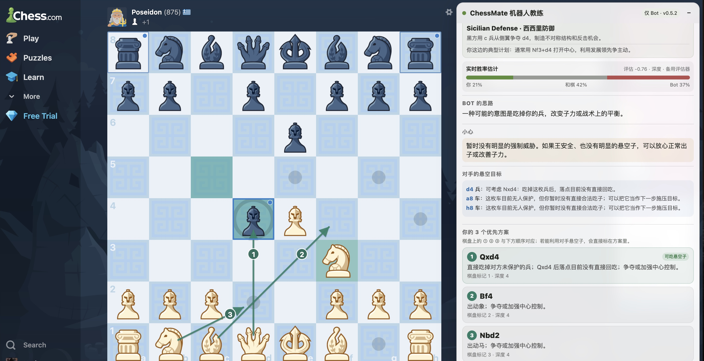
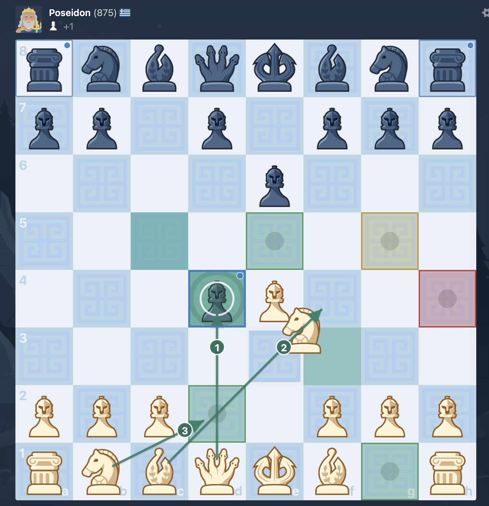
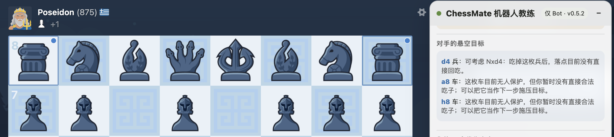
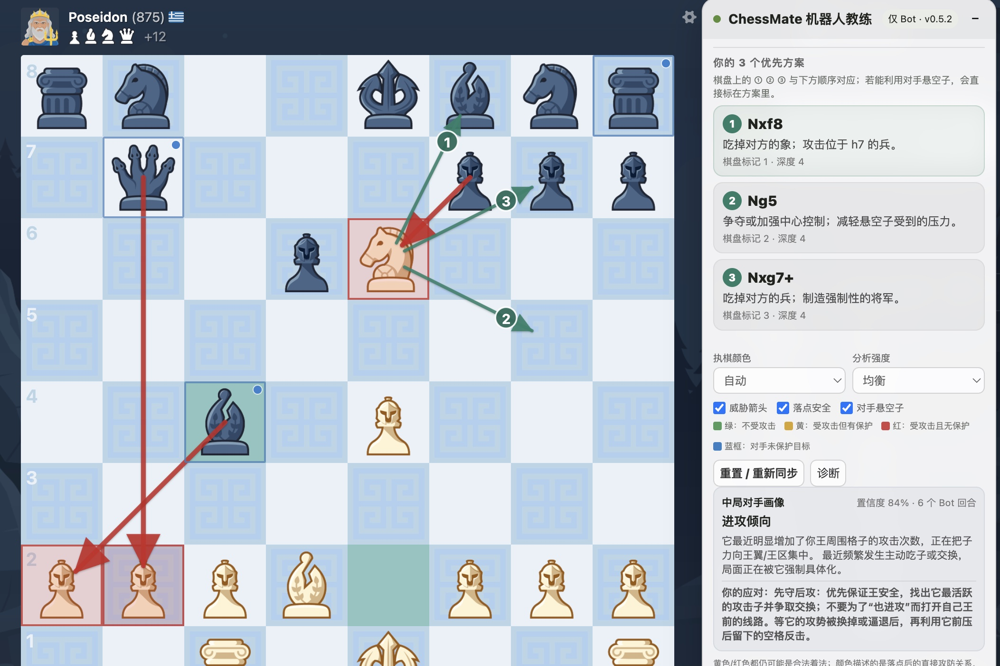

# ChessMate 机器人教练

**面向已确认 Chess.com 机器人/电脑对局的本地中文/英文棋局教练。**

[English](README.en.md) · 版本 0.5.2

> ChessMate 只会在受支持的 Chess.com Bot/Computer 页面启用，不用于真人对局。

## 下载

- [中文安装包（v0.5.2）](releases/ChessMate-Bot-Coach-ZH-v0.5.2-installable.zip)
- [English package (v0.5.2)](releases/ChessMate-Bot-Coach-EN-v0.5.2-installable.zip)

## 在 Chrome 中安装

1. 下载对应语言的 ZIP 并解压。
2. 在 Chrome 地址栏打开 `chrome://extensions`。
3. 打开右上角的**开发者模式**。
4. 点击**加载未打包的扩展程序**。
5. 选择解压后包含 `manifest.json` 的扩展目录。
6. 打开 [Chess.com Computer](https://www.chess.com/play/computer)，开始一盘机器人对局。

如果 Chrome 报错，请确认选择的是包含 `manifest.json` 的文件夹，而不是 ZIP 文件或它的上一级目录。

## 功能介绍

### 开局识别与实时结果估计

通过本地开局库识别常见开局，解释当前结构，并把本地局面评估换算为近似的胜/和/负概率。

### 三个候选方案与棋盘箭头

最多提供三个候选着法；教练面板和棋盘使用相同编号，并给出简短的计划说明。

### 落点安全可视化

根据走后格子的直接攻防关系标色：绿色表示不受攻击，黄色表示受攻击但有保护，红色表示受攻击且无保护。

### 悬空子与战术目标

识别对手未受保护的棋子，区分可以安全吃取的目标和仍需计算的交换，并在面板及棋盘上同步标记。

### Bot 风格画像与控制项

根据 Bot 最近的走棋判断它偏向进攻、防守/反击，还是保持均衡。用户可选择执棋颜色、分析强度，并开关威胁箭头、落点安全和悬空子提示。

## 隐私与公平性

- 分析在浏览器扩展内本地运行。
- 不会把账号凭据、走棋或个人数据发送到 ChessMate 外部服务器。
- 页面守卫只允许已确认的 Bot/Computer 路由和页面信号。
- 无法安全确认允许的对局时，扩展会暂停或关闭分析。

详见 [PRIVACY.md](PRIVACY.md) 与 [SECURITY.md](SECURITY.md)。

## 目录结构

- `extension/en/` — 英文解压版扩展
- `extension/zh/` — 简体中文解压版扩展
- `releases/` — 可下载 ZIP 安装包
- `docs/images/` — README 使用的真实截图

## 许可证

项目代码使用 [MIT License](LICENSE)。Stockfish 如单独提供，则受 GPLv3 约束；每个安装包内均包含相应声明。v0.5.2 未安装 Stockfish WASM 文件时会使用扩展内置的轻量本地备用评估器。
